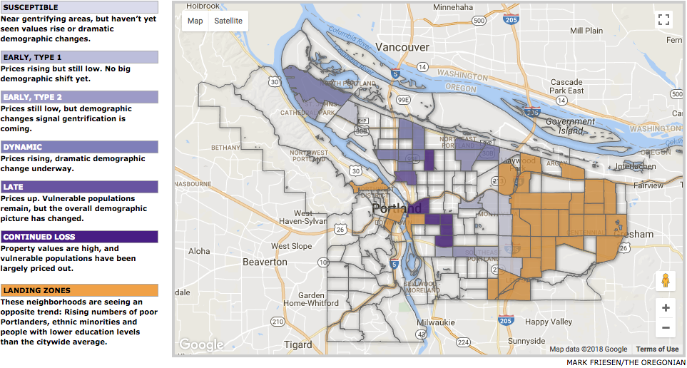
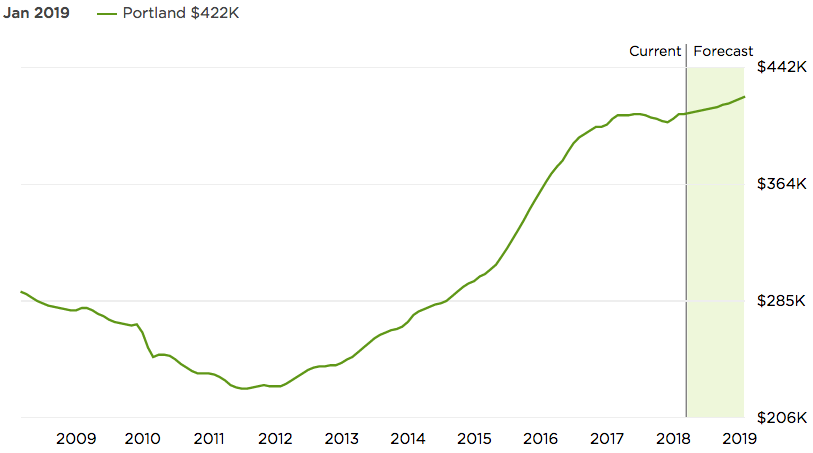
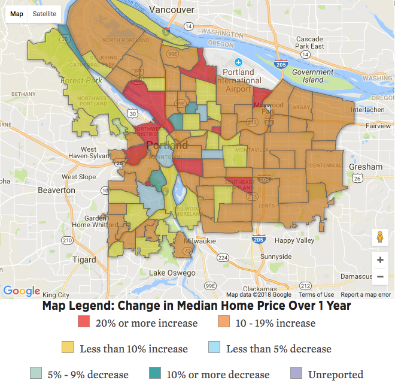

##Executive Summary
The City of Portland has experienced exceptional growth in the last 10 years [1]. This significant growth, along with the urban growth boundary [2] has led to average home prices in the city growing to all time highs and much faster than the national average.
Our study looks to predict the future median home prices over the next coming years to see how this trend will impact affordability within the city and region. 

This analysis defines affordability for the typical Portland household, then analyzes the each neighborhood's median sales price from 2012 through 2017. Evaluating the data shows significant variation in our dataset but three general trends are identified: the "flat but bouncy," most often correlated to high-priced neighborhoods; the "meeting price elasticity" found in the mid-market priced areas; and the "up-and-coming," appearing farther out from the city center. We then project median sales prices forward for <#> years and compare where affordability maps.

This information is valuable for several government and business purposes. Local and state legislators can identify andcontrol for, or assist those affected by radical growth in housing prices and the impacts of gentriciation. For business and construction, these trends can identify areas or neighborhoods that look to be show a balance between good value and likely ongoing growth in final sales prices. This would likely be housing developers or your single family home "flippers."

Ultimately, this data provides a simplified view into the complexities of real estate in one of the nation's hottest markets. It projects that trends remain hot and identifies that, over time, housing prices have continued to drive average home buyers further from the city center likley driving current residents in these highly sought after areas out.

***

##Business problem
This is an analysis of real estate pricing information for Portland, Oregon. Our interest is to predict how quickly the median housing price will climb within the city and compare that against the average family income. While identification of the overall trend in Portland is interesting, our group has broken the city down by neighborhood in order to classify and identify variations and trends across the region. 

If you are in real estate, then you should invest in areas with high growth in median sales prices predicted. If you are a city planner, you should focus your anti-gentrification policies and housing affordability efforts in these neighborhoods to reduce displacement in the resident populations.

***

##Related Work
###Portland's Bureau of Planning and Sustainability's R
The majority of our work has focused on the isolation of approriate data from our initial dataset and preparation for time series analysis. To determine the relevance of this undertaking, we did a survey of the topic and found several interesting correlaries. [Oregon Live is hosting an interactive map on this topic](https://projects.oregonlive.com/maps/gentrification/), showcasing a similar effort: to determine what neighborhoods are under pressure from gentrification and which are likely to be next. [3] "Map of Gentrification in Portland"[This study was generated by city planners from Portland's Bureau of Planning and Sustainability](https://www.portlandoregon.gov/bps/article/454027).

***
###Zillow
Zillow has a wealth of information including [their own proprietary "Zestimate"](https://www.zillow.com/zestimate/#acc) of a single properties estimate market value. As we explored their blogs and sites, we also found have historical information for the median home prices for [all of Portland with a forecast](https://www.zillow.com/portland-or/home-values/) that only goes out one year. They provide this information and a "market temperature" gauge to indicate if it's a buyer or seller's market.

***
###Portland Monthly Magazine
Those two examples were helpful as each was trying to show an element of our project, the mapping of data to location and the forecasting of prices. Another report by Portland Monthly magazine examined Portland's neighborhoods median change in price over one year, breaking the increases into blocks of prices increases. This visual shows that some popular inner-city neighborhoods continue to show 20% or higher increases in median sale price, while the majority of the outer city area, particularly the eastside have growth rates between 10-19%. This reflected our expectations and was another data point to make comparisons.

***

###S&P CoreLogic Case-Shiller Home Price Indices
We used a lot of resources in our research and evaluation but another important one to mention here is the [S&P CoreLogic Case-Shiller Home Price Indices](https://us.spindices.com/indices/real-estate/sp-corelogic-case-shiller-portland-home-price-nsa-index). This is an industry-standard for measuring the housing market and has been another great piece of data to compare against as we worked through our project. While we did not design a methodology to compare directly against this index, it's value as a cross-regional market data point could be used in future evaluations and comes up in many real estate research and evaluations as a key metric for market performance over time.

***

##Data Source, Data Exploration, Descriptive Statistics, Variable Selection
Our project required two data explorations: 1) defining and projecting affordability, and 2) forecasting median sales price by neighborhood in the city of Portland. 

***

###Affordability
For the first, we gathered and simplified criteria to use a generic, but Portland-based housing affordability rating over time. Given the large number of variables involved in purchasing a home, securing a mortgage, etc., we had to make a number of assumptions, detailed later on. Our goal was to create a synthetic but reprsentative value showing a average homeowner's purchasing power within this market. Our key datapoints and their sources were:

1. **Average Mortgage Rate** - [Freddie Mac: 30-Year Fixed-Rate Mortgages Since 1971](http://www.freddiemac.com/pmms/pmms30.html)
2. **Portland Median Family Income** - [Department of Numbers: Portland-Vancouver-Hillsboro Oregon Household Income](http://www.deptofnumbers.com/income/oregon/portland/)
3. **Average monthly Mortgage Payment** - [The Motely Fool: This Is the Average American Homebuyer In] 2017](https://www.fool.com/mortgages/2017/02/27/this-is-the-average-american-homebuyer-in-2017.aspx)
4. **Average down payment** - 14% [Sammamish Mortgage: Average Monthly Mortgage Payment in Portland, Oregon: 2017](https://www.sammamishmortgage.com/average-monthly-mortgage-payment-portland/)
5. **Average Homebuyer Mortgage** - The Present Value of the time-specific mortgage rate, the periods (360), and the monthly mortgage payment.

***

####Past and Projected Housing Affordability for Portland Median Family
Year  | Average Mortgage Rate | Portland Median Family Income | Average Monthly Mortgage | Average Homebuyer Purchase Price
----- | --------------------- | ------------------------------ | ------------------------ | --------------------------------
2022	| 4.15%	                | $94,918                        | $1,819                   | $426,648
2021	| 4.15%	                | $92,585                        | $1,775                   | $416,162
2020	| 4.15%	                | $90,252                        | $1,730                	  | $405,675
2019	| 4.15%	                | $87,919                        | $1,685                	  | $395,189
2018	| 4.15%	                | $85,586                        | $1,640                	  | $384,703
2017	| 3.99%	                | $83,253                        | $1,596                	  | $381,487
2016	| 3.65%	                | $82,734                        | $1,586                	  | $395,169
2015	| 3.85%	                | $78,183                        | $1,499                	  | $364,392
2014	| 4.17%	                | $73,419                        | $1,407                	  | $329,225
2013	| 3.98%	                | $73,550                        | $1,410                	  | $337,433
2012	| 3.66%	                | $73,386                        | $1,407                	  | $350,088

***

####Assumptions
1. Average Mortgage Rate was the annual average for 30-year fixed rate mortgages as reported by Freddie Mac.
    + We used a naive forecast for future annual mortgage rates, pegged to the current rate.
2. Median Family income was for Portland and was inflation adjusted.
    + Median family income was projected until 2022 using a simple line of best fit calculation.
3. Average monthly mortgage was calulated by multiplying the annual median family income by the front-end debt-to-income ratio, divided by 12 months. 
    + The front-end debt-to-income ratio is the buyer's new mortgage payment as a percentage of their pre-tax income
4. Average down payment is for 2017 and applied to all years.
4. No other household debts were taken into account. 
    + As a comparison, the back-end debt-to-income ratio was 35%.

###Forecasting Median Sales Price
####Data Source
The data for our analysis was sourced from the [Redfin Data Center](https://www.redfin.com/blog/data-center). The first things we had to do was convert a Tableau workbook file into a CSV. This compressed source file resulted in a 1.4GB CSV file. Since we were focused on Portland, our first psas was to filter to only Oregon. At this point, we were unsure if we would focus on the city alone, or the metro area.

The dataset was quite large and we initially reviewed the 47 variables for validity with our analysis in mind. We ultimately limited this to 13 variables, seven related to cost and availability which could be used for our preditinos. Another three variables related to the time series, and three related to the regions were selected to allow us to do appropriate filtering of our dataset from a nationwide, nearly 1.5 gigabyte CSV into a more manageable, Oregon-only dataset. 

As part of our data cleaning, we realized that the dataset periods offered were 90 day time slices, so we decided to select periods of January-March, April-June, July-September, and October-December in order to avoid overlapping data sets. It does appears that Redfin's analysis of this data used each 90-day average to represent the month in which the period ended. This causes some overlapping but also results in smoother data and more data points. If we ultimately decide that four data points per year is too few, we may consider re-factoring our data segmentation in a similar way.

##Methodologies Considered
With the project selection, we are limited to time series-based modeling. We initially used the linear trend time series modeling technique and compared this to the naive approach. We are also considering caomparing the accuracy of these two models to a model involving trend and seasonality if there is time.

##Next Steps
* Run time series model on training and validation sets
* Try various time series models and compare accuracy
    + Trend and seasonality
    + Linear, and polynomial 
    + Naive
* Compare accuracy between these models
* Create comparison array to evaluate neighborhood predictions
* Continue building report and narrative
* Investigate possibility of visualizing with a mapping tool
* Beautify graphs/visualizations

##References
[Redfin Data Center: Downloadable Housing Market Data From Redfin](https://www.redfin.com/blog/data-center)

[Gentrification and Displacement Study: implementing an equitable inclusive development strategy in the context of gentrification](https://www.portlandoregon.gov/bps/article/454027)